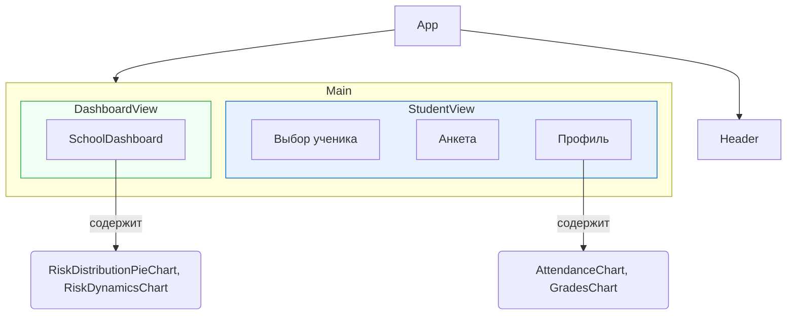

# Система раннего выявления социальных рисков в школе на базе ИИ

Это прототип интеллектуальной системы, предназначенной для помощи школьным психологам и социальным педагогам в раннем выявлении социальных и поведенческих рисков у учащихся. Платформа объединяет данные из различных источников, анализирует их с помощью ИИ и предлагает персонализированные планы поддержки, способствуя созданию безопасной и поддерживающей образовательной среды.

## 🎯 Цели и задачи проекта

1.  **Проактивное выявление рисков:** Идентифицировать учащихся, подверженных риску социальной изоляции, буллинга, академического стресса или снижения мотивации, до того как проблемы станут критическими.
2.  **Комплексная 360-градусная оценка:** Агрегировать и анализировать разнообразные данные — успеваемость, посещаемость, поведенческие инциденты и самооценку ученика (анкета SEL) — для получения целостного представления о его состоянии.
3.  **Формирование персонализированных планов поддержки:** Автоматически генерировать действенные, основанные на данных рекомендации для психологов, учителей и родителей.
4.  **Стратегический мониторинг на уровне школы:** Предоставлять администрации доступ к дашборду для отслеживания общих тенденций, оценки эффективности программ поддержки и эффективного распределения ресурсов.

## ✨ Ключевые возможности

*   **Интерактивный профиль ученика:** Отображает сводную информацию об успеваемости, посещаемости, зафиксированных инцидентах и динамику этих показателей в виде графиков.
*   **Адаптивная анкета SEL/Wellbeing:** Позволяет ученику быстро оценить свое эмоциональное состояние, уровень стресса и качество социальных взаимодействий.
*   **Аналитический движок на базе ИИ:**
    *   Анализирует собранные данные в комплексе.
    *   Определяет уровень риска (Низкий, Средний, Высокий) и его ключевую категорию.
    *   Формирует краткое резюме и предлагает конкретные рекомендации (например, консультация с психологом, запись в кружок по интересам, корректировка учебной нагрузки, прохождение микро-курса).
*   **Дашборд школы:**
    *   Визуализирует распределение учеников по группам риска в масштабе всей школы.
    *   Показывает динамику изменения числа учеников в группах риска во времени.
    *   Генерирует краткосрочный прогноз о потенциальных вызовах на основе анализа текущих данных.

---

## 🛠️ Технологический стек

*   **Фронтенд:** `React 19` (с использованием Hooks), `TypeScript`, `Tailwind CSS` для стилизации.
*   **Визуализация данных:** `Recharts` для построения интерактивных графиков и диаграмм.
*   **Интеграция с ИИ:**
    *   **Модульная архитектура:** Система использует сервис `services/geminiService.ts`, который инкапсулирует логику взаимодействия с ИИ.
    *   **Текущая модель:** В данный момент используется API **Minimax** (совместимый с OpenAI). Архитектура позволяет легко переключиться на **Google Gemini API** или любую другую LLM, изменив только код сервисного слоя.
*   **Среда выполнения:** Проект настроен для работы напрямую в браузере без этапа сборки, используя `importmap` для управления зависимостями. Это идеально подходит для таких платформ, как AI Studio.

---

## 🏗️ Архитектура и поток данных

Система собирает данные из двух источников: формальные данные из школьных систем (симулированы в `mockData.ts`) и ответы ученика из анкеты. Эти данные объединяются и отправляются в ИИ-сервис для анализа, который возвращает структурированный JSON с оценкой риска и рекомендациями.

```mermaid
graph TD
    subgraph "Пользовательский интерфейс (UI)"
        A[Психолог выбирает ученика] --> B{Профиль ученика};
        B -- Данные --> C[Посещаемость, Оценки, Инциденты];
        A --> D[Запускается анкета SEL/Wellbeing];
        D -- Ответы --> E[Данные анкеты];
    end

    subgraph "Бэкенд и ИИ (Клиентская сторона)"
        F[Объединение данных]
        C --> F;
        E --> F;
        F --> G[API-запрос к ИИ-модели (Minimax/Gemini)];
        G --> H{Результат анализа (JSON)};
    end

    subgraph "Результат в UI"
        H --> I[Обновление профиля ученика];
        I --> J[Отображение уровня риска];
        I --> K[Показ резюме и рекомендаций];
    end

    style F fill:#f9f,stroke:#333,stroke-width:2px
    style G fill:#ccf,stroke:#333,stroke-width:2px
    style H fill:#9f9,stroke:#333,stroke-width:2px
```

### Структура компонентов React

Приложение построено на компонентном подходе. Главный компонент `App.tsx` управляет навигацией между двумя основными представлениями: профилем ученика и дашбордом школы.



---

## 📁 Структура проекта

```
.
├── index.html                # Точка входа HTML
├── index.tsx                 # Точка входа React-приложения
├── App.tsx                   # Главный компонент, управляющий состоянием и навигацией
├── types.ts                  # Определения типов TypeScript
├── services/
│   ├── mockData.ts           # Статические (симулированные) данные для учеников и школы
│   └── geminiService.ts      # Логика для взаимодействия с API ИИ-модели
└── components/
    ├── StudentProfile.tsx        # Компонент для отображения полного профиля ученика
    ├── ScreeningQuestionnaire.tsx # Компонент анкеты для самооценки
    ├── SchoolDashboard.tsx       # Компонент дашборда с общей аналитикой
    ├── charts/
    │   └── Charts.tsx            # Компоненты-обертки для графиков Recharts
    └── icons/
        └── Icons.tsx             # Набор SVG-иконок
```
